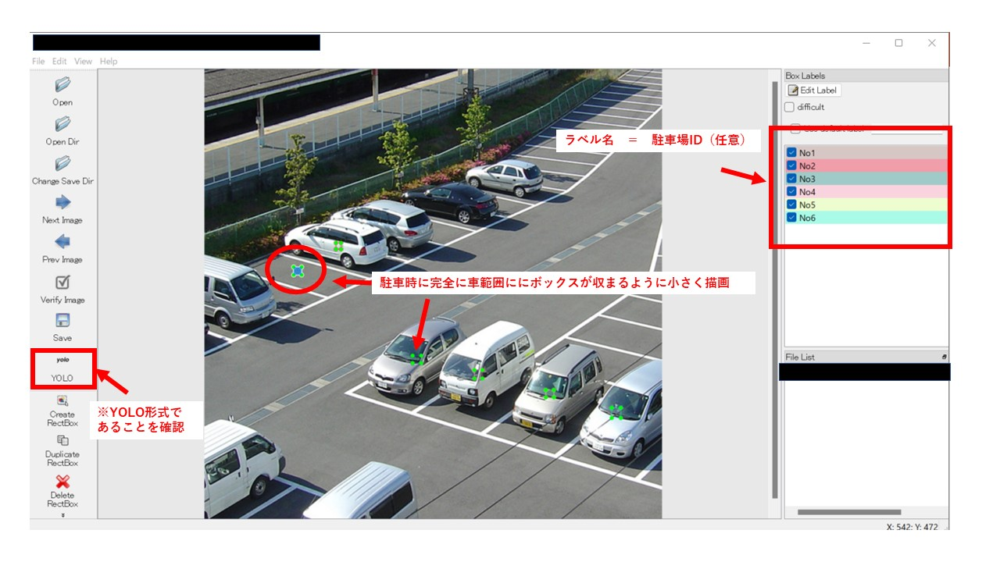

# 駐車場の車体数検知

## 概要
* 物体検知モデルにより駐車場内の車を検知し、使用状況を確認する。.

## 事前準備
1. 駐車場のデータの登録

    * Labelimg のインストール　[Labelimg_参考URL](https://laid-back-scientist.com/labelimg)
    * 駐車場画像データの作成
        1. 駐車場写真（車なし時が好ましい）を適当なフォルダに格納する。ex. ./data
        2. position_classes.txt　（白紙のテキストファイル）を上記フォルダ内に作成する。
        3. 駐車場写真を下記コマンドにてLabelimgで開く。（./labelImg.exe等 Pathは任意）
            ```
             .\labelImg.exe ./data ./data/position_classes.txt
            ```
        4. 各駐車場の中心部分にバウンディングボックス（BB）を描画しラベル名は駐車場の登録名(ex. No.XX)とする。
            * 注意点
                1. YOLO形式にて保存する。
                2. 駐車時にBBが車に完全に隠れるように描画する。（参考図）
        
        5. 出力されるラベル名を　position_label.txt　に変更する。

2. 物体検知モデルの環境構築
    * 当リポジトリのCloneをする。
        ```
        git clone https://github.com/okome-git/car-park-detection.git
        ```
    * リポジトリ直下に　1.にて作成した　position_label.txt　及び　position_classes.txt　をコピーする。
    * リポジトリ直下に物体検知に用いる学習重み（ptファイル）をコピーする。（別途提供）

## 単純検知方法
* リポジトリ直下の　detect.py を実行する。
    * パラメータ
        * --weights 学習重みファイル： ex. weights.pt
        * --source 入力データ：　画像→フォルダPath ./data/images/
    ```
    python detect_cars_imagefile.py --weights car_aerial_view.pt --source ./data/sample/
    ```
    * COCOの重みを利用する場合
        * --weights yolov5s.pt
        * --classes 3 6 8 
           https://gist.github.com/AruniRC/7b3dadd004da04c80198557db5da4bda
        * --source 入力データ：　画像→フォルダPath ./data/images/
    ```
    python detect_cars_imagefile.py --weights yolov5s.pt --source ./data/sample/ --classes 3 6 8
    ```

## 車体数検知方法
### 画像 動画データの場合
* リポジトリ直下の　detect_cars_imagefile.py を実行する。
    * パラメータ
        * --weights 学習重みファイル： ex. weights.pt
        * --source 入力データ：　画像→フォルダPath ./data/images/
    ```
    python detect_cars_imagefile.py --weights car_aerial_view.pt --source ./data/sample/
    ```

### webカメラやIPカメラの場合
* リポジトリ直下の　detect_cars_camera_input.py を実行する。
    * パラメータ
        * --weights 学習重みファイル： ex. weights.pt
        * --interval 検知間隔(秒)： ex. 1分　→　60
        * --source 入力データ：　webカメラ 0(デバイスNO) , IPカメラ http://***
    python detect_cars_camera_input.py --weights car_aerial_view.pt --interval 60 --source 0
    ```

## 出力
* ログ例　（指定画入力時）
    ```
    .....モデル作成中....
    ....................
    【入力 1/1 /usr/src/app/yolov5/data/images/sample.jpg: 640x640 】　【car　：　9台】【truck　：　4台】(処理時間0.219sec)
    駐車中：['No5', 'No4', 'No6', 'No3', 'No2']
    空：['No1']
    判定結果は runs/detect/exp25　へ保存しています。
    ```

